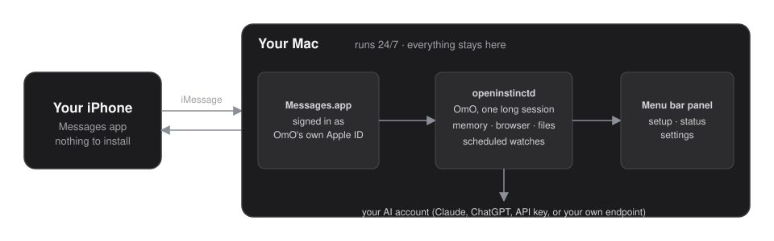
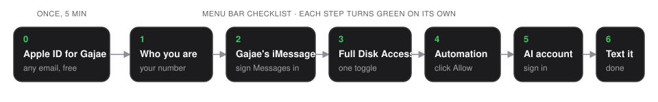
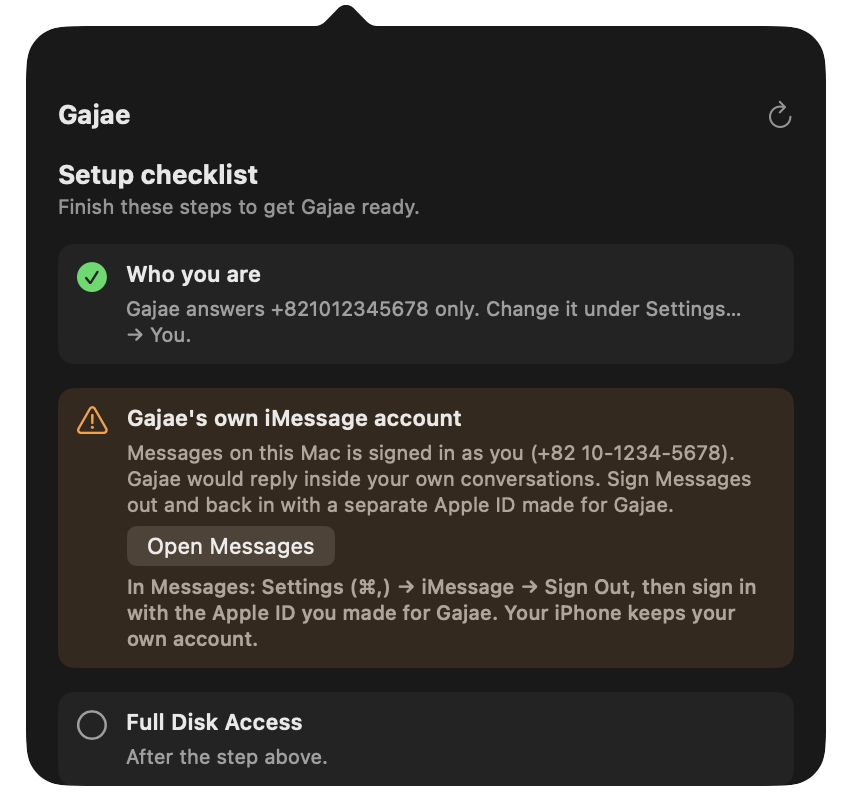
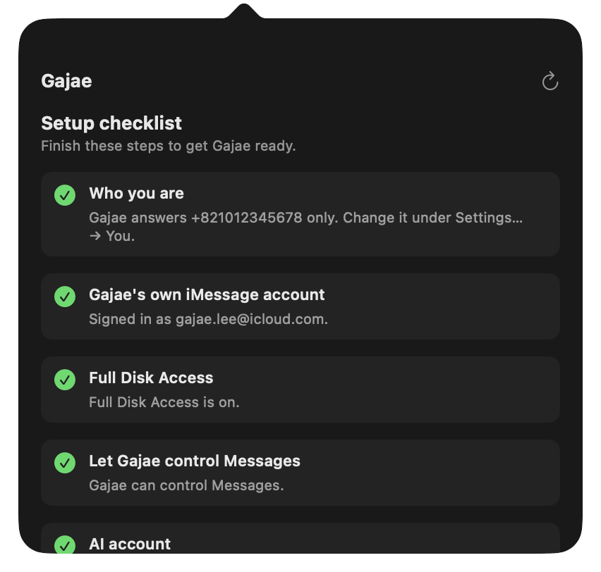
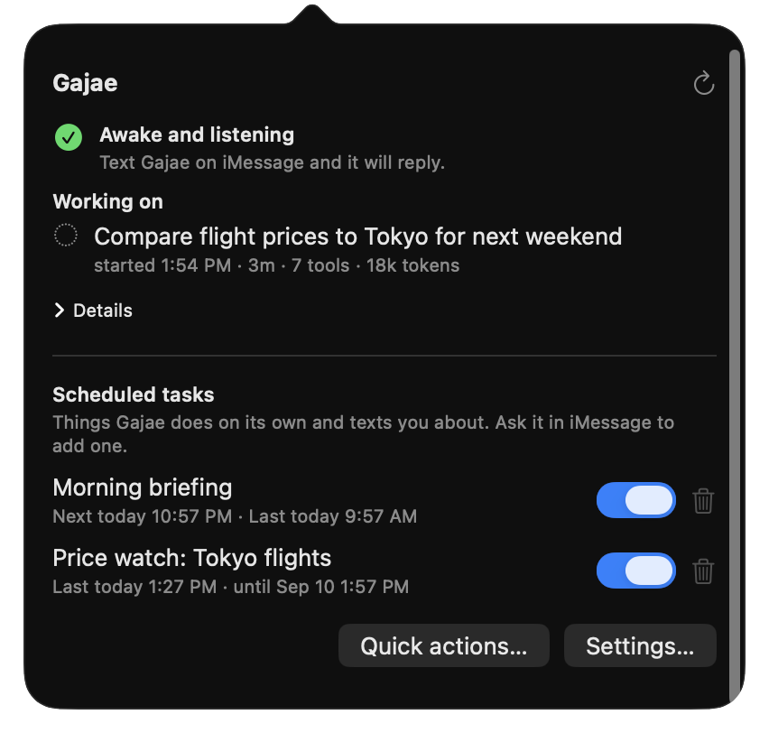

<p align="center">
  
</p>

<h1 align="center">OpenInstinct</h1>

<p align="center">
  A personal AI agent that lives on your Mac and talks to you in its Chat window.<br>
  iMessage is optional: connect it when you want phone texting. Nothing leaves your machine except the model call.
</p>

<p align="center">
  <a href="docs/user-guide.md">User guide</a> ·
  <a href="docs/architecture.md">Architecture</a> ·
  <a href="docs/runbook.md">Runbook</a> ·
  <a href="docs/ko/README.md">한국어</a>
</p>

<p align="center">
  
</p>

Use the Chat window, or text from your phone after connecting the optional iMessage
lane. Gajae reads, browses with its own Chrome, remembers, runs long work in the
background, and keeps scheduled watches. The character is **Gajae** — the same
persona as [gajae-code](https://github.com/Yeachan-Heo/gajae-code)'s `gjc`, running
as an always-on daemon instead of a terminal session.

## Setup

One command. It copies files and gets out of the way; the menu bar does the rest, live.

```sh
curl -fsSL https://raw.githubusercontent.com/Yeachan-Heo/openinstinct/main/scripts/install-remote.sh | sh
```
Gatekeeper only inspects downloads that a *browser* tagged with
`com.apple.quarantine`, so a curl-fetched install never hits an "unidentified
developer" wall — no certificate involved. If you would rather not pipe curl
into a shell, download the `.tar.gz` from
[Releases](https://github.com/Yeachan-Heo/openinstinct/releases/latest),
`tar -xzf` it, and run `sh <dir>/scripts/bootstrap-from-payload.sh <dir>`.

<p align="center">
  
</p>

<table>
<tr>
<td width="50%"></td>
<td width="50%"></td>
</tr>
<tr>
<td align="center"><sub>The optional iMessage lane refuses to run on <em>your</em> Apple ID and says which account it saw.</sub></td>
<td align="center"><sub>Optional iMessage steps turn green as you complete them; Chat itself needs only an AI account.</sub></td>
</tr>
</table>

The menu-bar panel opens Chat as soon as an AI account is ready. Phone number,
Messages identity, Full Disk Access, Automation, and Accessibility are only for
the optional iMessage lane. Full walkthrough: [docs/user-guide.md](docs/user-guide.md).

```
you (Chat window) ──control socket──▶ openinstinctd
                                           │
you (iPhone) ──optional iMessage──▶ Messages.app on the Mac ──chat.db──▶ openinstinctd
                                           │                                      │
                                           └──AppleScript send── Messages.app ◀────┘
                                                                                │
                                                    one persistent gjc SDK session
                                                    ├─ shared owner-turn ingress
                                                    ├─ browser (own Chrome profile)
                                                    ├─ memory (git repo, BM25 recall)
                                                    ├─ background children
                                                    └─ monitors (cron / watch / webhook)
```

## What it does

- **Chat window** — a separate iMessage-like, plain-text conversation. It is ready
  as soon as an AI account is signed in. Chat and iMessage use one persistent
  session and one shared owner-turn ingress, so steering and memory stay coherent.
- **Optional iMessage** — connect a phone handle later to mirror owner-turn replies,
  images, typing, and read presence through Messages. Chat keeps working when this
  lane is detached.
- **Images** — send a photo, it looks at it; when it looks at a screenshot itself,
  you get the picture too.
- **Background work** — anything slow (browsing, scraping, long research) runs in a
  child session; you get "on it" then the result.
- **Monitors** — author cron, file, and webhook watches from chat, toggle or delete
  them from the menu bar, or use **Run now** / `monitors.run` for a deterministic
  manual firing. Failures are triaged by the agent, not dumped on you.
- **Memory** — every owner turn is captured in a git-backed memory repo with the
  gajae-way layout (daily → people/projects/decisions), canonicalized and audited.
  `memory.backfillCaptures` safely replays older owner exchanges into the correct
  daily files without duplicating entries or daemon-injected prompts.
- **AI accounts** — Settings can discover existing Claude, ChatGPT/Codex CLI
  credentials and shows an explicit **Adopt** action; adoption is never automatic.
- **Its own Chrome** — a dedicated profile you sign into once; the browser tool is
  hard-pinned to it and can never touch your personal Chrome.
- **Daily insight** — once a day it studies how you use the Mac and proposes
  automations before you ask.
- **Menu bar panel** — health in plain words, an always-available Chat window,
  scheduled tasks, pause/resume, and Settings for AI account (OAuth or custom
  endpoint), optional iMessage, owner, browser, limits, and personality.

<p align="center">
  
</p>

## Chat first, optional iMessage

The Chat window talks to the daemon over its control socket and is available as
soon as an AI account is ready. Chat does not need a phone number, Messages,
`chat.db`, Full Disk Access, Automation, or Accessibility.

If you also want phone texting, configure the optional iMessage lane from
**Settings… → iMessage**. Use a dedicated Apple ID in this Mac's Messages app;
the identity gate refuses the owner's own account. The lane can attach or detach
without restarting the shared session, and Chat remains available throughout.

## Install (developer)

```sh
git clone … openinstinct && cd openinstinct
bun install
bash scripts/install.sh          # daemon + launchd + panel + presence helper
bash scripts/build-release.sh    # → dist/openinstinct-<version>-darwin-arm64.tar.gz
```

Gates:

```sh
bun test daemon/test
bunx tsc --noEmit -p tsconfig.json
bash scripts/drills/failure-drills.sh
(cd panel && swift test)
bun scripts/docs-screenshots.ts  # re-renders docs/assets/*.png against a mock daemon
```

## Layout

| Path | What |
|---|---|
| `daemon/src/main.ts` | daemon composition root: bootstrap, inbox loop, lanes |
| `daemon/src/bootstrap/` | config / Messages identity / permission probes → `identity_blocked` etc. |
| `daemon/src/imessage/` | chat.db reader (cursor, attributedBody), AppleScript sender |
| `daemon/src/sdk-session/` | the persistent main session: steer, watchdog, segments, reload |
| `daemon/src/children/` | background children (in-process SDK sessions with the same soul and browser guard) |
| `daemon/src/monitors/` | monitor store, cron scheduler, triggers, propagation/triage |
| `daemon/src/memory/` | vendored gajae-way memory (`vendor/`) + adapters + tools |
| `daemon/src/persona/` | `GAJAE_SOUL.md` (character) and `RUNTIME.md` (where it is) |
| `daemon/src/browser/` | hard enforcement of the dedicated Chrome profile |
| `daemon/src/control/` | NDJSON Unix-socket control protocol for the panel |
| `daemon/src/settings/` | owner-editable settings, gjc auth-broker bridge |
| `panel/` | SwiftUI menu-bar app (`NSStatusItem` + popover + separate Chat window + Settings window) |
| `presence/` | `oi-presence`: typing indicator / read receipts via Accessibility |
| `scripts/` | install, release archive, screenshots, acceptance harness, soak, drills |
| `docs/` | [user guide](docs/user-guide.md), [architecture](docs/architecture.md), [runbook](docs/runbook.md) |

## Non-goals

Group chats, voice, tapbacks as commands, multiple owners, remote access, SIP off.

## License

Source under this repository's license. `presence/` adapts technique from
[beeper/platform-imessage](https://github.com/beeper/platform-imessage) (MIT, notice
included). `daemon/src/memory/vendor/` is copied from gajae-way at a pinned commit
(see `daemon/src/memory/PROVENANCE.md`).
